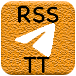

# RSS to Telegram bot

[](https://hub.docker.com/r/rongronggg9/rss-to-telegram)
[](https://hub.docker.com/r/rongronggg9/rss-to-telegram)
[](https://hub.docker.com/r/rongronggg9/rss-to-telegram)
[](https://github.com/Rongronggg9/RSS-to-Telegram-Bot)

[](https://t.me/GZMTR_Pill)

**这是为 [每日羊角观察](https://t.me/GZMTR_Pill) 频道的附属频道 [羊角微博观察](https://t.me/GZMTR) 编写的 RSS bot 。**

在频道中使用时，希望您能说明使用了本项目，并附上到本项目的链接。

本项目原是 [BoKKeR/RSS-to-Telegram-Bot](https://github.com/BoKKeR/RSS-to-Telegram-Bot) 的 fork ，考虑到改动较大，
因此复制成独立的 repository 。

## 功能

- 将 RSS 全文转发到 Telegram
    - 转发时不丢失原有格式
    - 转发时自动将微博表情转化为同义 emoji
        - 仅限有同义 emoji 的微博表情
    - 超长消息自动分割
        - 多媒体消息编码后大于 1024 字，无图消息编码后大于 4096 字
- 支持含图消息转发
    - 至多 10 张图片
    - 自动缩小大于 5MB 或尺寸过大的图片
        - 仅限微博图源，其他图源的过大图片将被直接丢弃
        - Telegram 文档中只给出图片大小 5MB 限制，但实际上需要`宽度 + 高度 <= 10000`
- **(alpha)** 支持微博视频转发
- 转发失败时向 `MANAGER` 发送含错误信息的提示 **(未设定则直接发送至 `CHATID` )**
- **设定 `MANAGER` 时只会响应对应用户的命令 (未设定则只响应 `CHATID` 对应用户的命令)**


## 已知的问题

- 针对 RSSHub 生成的微博 RSS 源编写，对于其他 RSS 源可能出现不可预料的问题
    - 非微博图源的过大图片/视频将被直接丢弃
    - 图片至多 10 张 (考虑到微博已推出超九图功能，将在未来修复)
- 微博视频转发清晰度较低，若视频过大也将被直接丢弃
- 用于频道时，无法接受频道内的命令，需直接对 bot 在私人对话中发送命令
    - **必须设定 `MANAGER` 并使用其对应的用户操作，否则不会响应**
- 没有多用户功能，仅可向一个用户/频道 ( `CHATID` ) 推送 RSS

## 使用

> RSS to Telegram bot (Weibo Ver.)
> 
> 成功添加一个 RSS 源后, 机器人就会开始检查订阅，每 300 秒一次。 (可修改)
> 
> 标题为只是为管理 RSS 源而设的，可随意选取，但不可有空格。
> 
> 命令:
>
> **<u>/help</u>** : 发送这条消息
>
> **<u>/add 标题 RSS</u>** : 添加订阅
>
> **<u>/remove 标题</u>** : 移除订阅
>
> **<u>/list</u>** : 列出数据库中的所有订阅，包括它们的标题和 RSS 源
>
> **<u>/test RSS 编号(可选)</u>** : 从 RSS 源处获取一条 post (编号为 0-based, 不填或超出范围默认为 0)
> 
> 您的 chatid 是: 0123456789

### 准备

1. 前往 [@BotFather](https://t.me/BotFather) 创建一个 bot ，并记录下 token ，稍后填入 `TOKEN`
2. 获得您的 userid (可使用 [@userinfobot](https://t.me/userinfobot) 获取) 并记录下来，稍后填入 `CHATID`
    - 您也可使用一个频道来接收推送，此时 `CHATID` 格式为 `@channelusername` (不要忘记将 bot 添加到频道里!)
3. 获得管理员 (通常为您) 的 userid ，方法同上，稍后填入 `MANAGER`


### Docker

For the docker image go to: https://hub.docker.com/r/rongronggg9/rss-to-telegram

```sh
docker create \
    --name [container name] \
    --restart unless-stopped \
    -v [path to config]:/app/config \
    -e DELAY=[delay] \
    -e TOKEN=[bot token] \
    -e CHATID=[target user userid / @channelusername] \
    -e MANAGER=[bot manager userid] \
    -e PROXY=[scheme://host:port/]
    rongronggg9/rss-to-telegram
```
```sh
docker start [container name]
```
- 方括号`[]`不是命令的一部分
- 请务必设置`-v [path to config]:/app/config`，否则重新配置容器后订阅数据将丢失
- 代理仅对 Telegram Bot API 生效，对 RSS 订阅不生效。考虑到 DNS 污染问题，请尽量使用 socks5 代理，并在填入的代理 URL 里使用`socks5h`而不是`socks5`，示例: `socks5h://127.0.0.1:1080/`

### Installation

Python 3.6+

```sh
pip install feedparser
pip install python-telegram-bot
pip install html2text
pip install bs4
```

A telegram bot is needed that the script will connect to. https://botsfortelegram.com/project/the-bot-father/
Running the script and typing in /help will reveal the current chatId, this needs to be set also in the script

1. Clone the script
2. Replace your chatID and Token on the top of the script.
3. Edit the delay. (seconds)
4. Save and run
5. Use the telegram commands to manage feeds

Warning! Without chatID the bot wont be able to send automated messages and will only be able to respond to messages.


## 源项目 README



A self-hosted telegram python bot that dumps posts from RSS feeds to a telegram chat. This script was created because all the third party services were unreliable.


### Docker

For the docker image go to: https://hub.docker.com/r/bokker/rss.to.telegram/

### Installation

Python 3.X

```sh
pip install feedparser
pip install python-telegram-bot
```

A telegram bot is needed that the script will connect to. https://botsfortelegram.com/project/the-bot-father/
Running the script and typing in /help will reveal the current chatId, this needs to be set also in the script

1. Clone the script
2. Replace your chatID and Token on the top of the script.
3. Edit the delay. (seconds)
4. Save and run
5. Use the telegram commands to manage feeds

Warning! Without chatID the bot wont be able to send automated messages and will only be able to respond to messages.

# Usage

send /help to the bot to get this message:

> RSS to Telegram bot
>
> After successfully adding a RSS link, the bot starts fetching the feed every 60 seconds. (This can be set)
> Titles are used to easily manage RSS feeds and need to contain only one word
>
> commands:
>
> **/add** title http://www(.)URL(.)com
>
> **/help** Shows this text
>
> **/remove** !Title! removes the RSS link
>
> **/list** Lists all the titles and the RSS links from the DB
>
> **/test** Inbuilt command that fetches a post from Reddits RSS.
>
> The current chatId is: 20416xxxx

# Known issues

If the bot is set to for example 5 minutes and one feed manages to get 2 new posts before the bot can check. Only the newest post will show up on telegram.
(注：本项目已修复)

# Docker

```
docker create \
  --name=rss.to.telegram \
  -e DELAY=60 \
  -e TOKEN=InsertToken \
  -e CHATID=InsertChatID \
  -v /path/to/host/config:/config \
  --restart unless-stopped \
  bokker/rss.to.telegram
```
